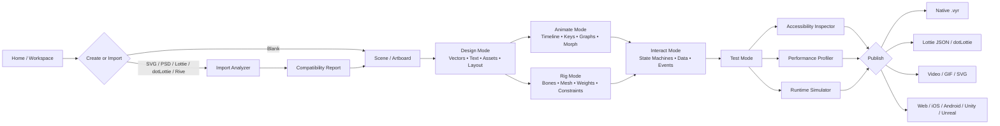
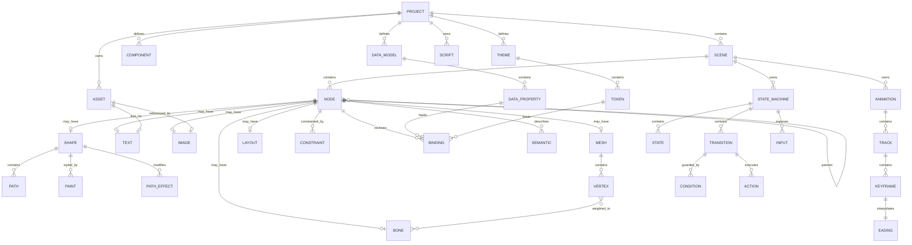
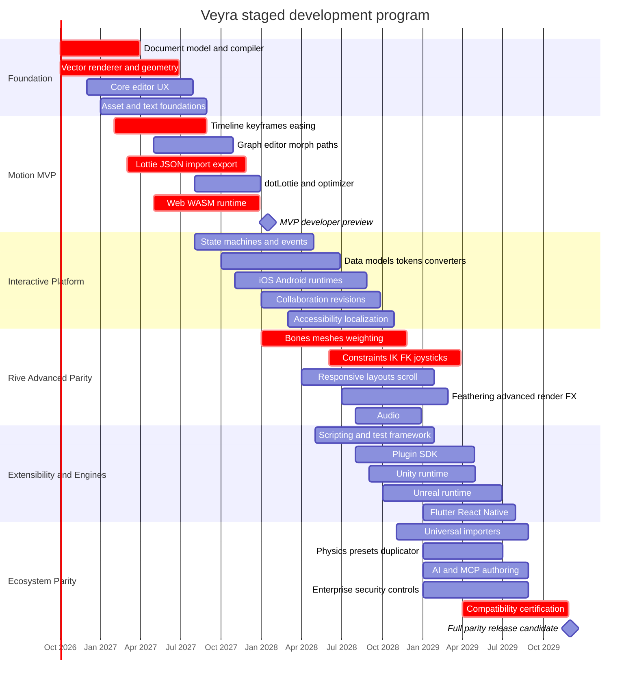

# Veyra: Deep-Research Product and Technical Blueprint for a Lightweight Rive-and-Lottie-Parity Animation Platform

## Executive summary

Veyra should not be designed as “another Lottie editor” or “a smaller Rive.” The two ecosystems overlap, but their architectural centers are different. **Rive is an integrated interactive-graphics system**: editor, compact binary format, animation graph, state machines, data binding, responsive layout, skeletal/mesh deformation, scripting, accessibility semantics, and native runtimes. **Lottie began as a JSON interchange/runtime format for After Effects animations**, but by September 2026 the broader LottieFiles ecosystem adds a browser-native authoring environment, dotLottie containers, state machines, Motion Tokens, AI-assisted creation, plugins, multi-animation bundles, theming, and a Rust-based cross-platform runtime stack. citeturn15view1turn10view0turn18view0turn23search15

That distinction matters for Veyra. “Include every feature Rive and Lottie offer” means Veyra needs to cover three separate surfaces:

| Parity surface | What Veyra must reproduce |
|---|---|
| **Rive** | Native vector authoring; timelines; keyframes; advanced easing; components; layouts; clipping; blend modes; text; image/audio/font assets; bones; weighted meshes; IK and other constraints; joysticks; state machines; events/listeners/actions; data binding/view models; runtime asset replacement; scripting; accessibility semantics; reduced-motion handling; collaboration/revisions; web/mobile/game runtimes. citeturn1view0turn9view0turn9view1turn9view2turn10view2 |
| **Lottie specification/runtime ecosystem** | JSON composition/layer/asset model; animated properties; cubic easing; spatial motion paths; animated Bezier paths; masks and mattes; precompositions; images/text; Bodymovin compatibility; SVG/Canvas/HTML playback; runtime playback/events/text APIs. citeturn12view0turn13view1turn3view2 |
| **Current LottieFiles Creator/dotLottie platform** | Native browser authoring; graph editor; state machines; Motion Tokens/slots; themes; multi-animation packages; AI authoring; Creator plugins; wide import/export support; workspace collaboration/versioning; optimized dotLottie; cross-platform Rust-backed runtimes. citeturn18view0turn22view1turn22view3turn17search5turn23search28 |

The biggest competitive gaps are clear. **Rive is materially ahead in character/rig deformation, responsive layout, native data models, semantic accessibility, and deeply integrated interactive graphics.** Its editor supports bones, weighted meshes, IK/FK blending, multiple constraints, layouts, vector feathering, and view-model-based data binding. citeturn9view0turn9view1turn9view3turn8view3turn8view1turn10view2 **LottieFiles is materially ahead in ecosystem interchange, AI-assisted workflows, conventional extension plugins, Motion Tokens, multi-animation distribution, and breadth of import/export.** Creator 2.0 also has native state-machine authoring, removing one of Rive's former major differentiators. citeturn4search2turn18view0turn22view1

The best Veyra architecture is therefore a **native scene/interaction format more expressive than Lottie, with first-class Lottie/dotLottie interoperability**, rather than using Lottie JSON as Veyra's internal representation. The Lottie schema does not standardize the full Rive-style skeleton/layout/constraint/data-binding feature set, whereas Rive's own `.riv` file is specifically a binary representation of artboards, shapes, animations, state machines and related objects. citeturn12view0turn15view1

For runtime architecture, the strongest design is a **single Rust core** compiled to WASM for web and native libraries for Apple, Android, Unity and Unreal, exposed through a stable C ABI plus idiomatic wrappers. This mirrors two independently validated strategies: Rive centralizes much of its runtime logic in C++ and uses WASM on the web, while LottieFiles' current native player exposes its Rust `dotlottie-rs` core through C/C++. citeturn21search4turn15view2turn23search28 Veyra should own its scene evaluator and vector renderer because relying solely on an existing Lottie renderer cannot provide Rive-equivalent meshes, constraints, vector feathering, responsive layout, or custom path effects.

A realistic **full-parity program is approximately 220–320 engineer-months**, with a practical calendar duration of roughly **30–42 months for a stable 10–14-person multidisciplinary team**, assuming substantial parallel development. This is my engineering estimate, not vendor data. A genuinely lightweight MVP can be built far sooner, but it cannot honestly satisfy the stated “every Rive and Lottie feature” requirement. Therefore, the recommended product semantics are:

**Veyra Preview / MVP:** vectors, text/images, hierarchy/precomps, timelines/keyframes/easing, masks/mattes/blends, Lottie JSON/dotLottie import/export, web runtime, basic state machines, tokens, profiler, keyboard-first editing.

**Veyra 1.0 parity target:** mobile runtimes, data binding, collaboration/versioning, complete text/layout system, bones/weights/meshes/IK, full constraint system, plugin SDK, scripting, accessibility semantics, advanced imports, Unity/Unreal, AI, physics/presets, and complete compatibility testing.

For “lightweight,” set explicit budgets from day one. As a useful baseline, Rive reported January 2026 Brotli-compressed web runtimes of about **222 KB for canvas-lite, 567 KB for canvas and 648 KB for webgl2**. citeturn15view2 Veyra should target approximately **≤250 KB Brotli for its minimal vector/timeline web runtime and ≤700 KB for the complete interactive renderer before optional text, audio, scripting and debugging modules**. Those are recommended Veyra targets, not claims about competitor performance.

## Scope, competitive baseline, and parity matrix

The term **Lottie** needs careful scoping. The formal Lottie specification defines a JSON animation model and schema, not an editor comparable to Rive. Its root animation object contains dimensions, frame rate, in/out points, layers, assets, markers and related metadata; animated properties hold keyframes with timing and easing data. citeturn3view0turn12view0 Historically, After Effects plus Bodymovin supplied the authoring pipeline, and `lottie-web` rendered the exported data. The official lottie-web repository still documents the Bodymovin workflow and SVG, Canvas and HTML renderers. citeturn3view2

For this report, **“Lottie parity” therefore means the union of the public Lottie specification, Airbnb's official Lottie runtimes/Bodymovin workflow, and the current official LottieFiles Creator/dotLottie ecosystem as of September 8, 2026.** Lottie Creator itself is now described by LottieFiles as a professional authoring tool with drawing, layers, precompositions, timelines, keyframes, graph editing, state machines, tokens, plugins and AI tools. citeturn18view0

The following matrix is the fastest way to see where Veyra's parity burden comes from.

| Capability | Rive | Lottie / Creator / dotLottie | Gap or unique capability Veyra must cover |
|---|---|---|---|
| Native vector authoring | **Full.** Procedural/custom shapes, multiple paths, fills/strokes, gradients and path editing. citeturn8view0turn8view1 | **Full in Creator.** Rectangle, ellipse, polygon, star, Pen/path editing and path conversion. citeturn19view0turn18view0 | Both required. |
| Timelines/keyframes | **Full.** Multiple animations per artboard; work area; loops, one-shot, ping-pong; keyable properties. citeturn7view0turn7view1 | **Full.** Timeline, keyframes, time stretch, work area, property shortcuts. citeturn18view0turn20view0 | Baseline parity. |
| Advanced easing/graphs | Linear, hold, cubic, elastic and “Cubic Value”; graph editor. citeturn7view2turn14view0 | Native Advanced Graph Editor with Bezier handles and frame-level curve control. citeturn19view2 | Implement both standard easing and value curves/springs. |
| Spatial motion paths | Follow-path constraint in Rive; animated paths and transforms. citeturn1view0 | Lottie keyframes can contain spatial in/out tangents for position. citeturn12view0 | Veyra should have explicit editable motion paths. |
| Morph/path animation | Paths/vertices and Bezier geometry can be animated. citeturn7view1turn8view0 | Bezier Shape properties are animatable; Creator also exposes morphable vector properties. citeturn12view0turn19view0 | Use topology-aware path interpolation. |
| Bones/skeletons | **Full.** Bone chains, root/child transforms and weighting. citeturn9view1 | **Not standardized in Lottie schema or documented as a native Creator rigging system.** citeturn12view0turn18view0 | Rive-driven requirement. |
| Mesh deformation | **Full.** Triangulated image meshes, manual/automatic topology and bone weights. citeturn9view0 | No equivalent standardized mesh primitive in current core Lottie schema. citeturn12view0 | Rive-driven requirement. |
| IK/FK | **Full.** IK constraints solve bone rotations; strength can blend IK with FK. citeturn9view3 | Not a standardized Lottie/Creator authoring primitive. citeturn18view0 | Rive-driven. |
| Other constraints | IK, distance, transform, translation, scale, rotation; docs also expose follow-path and scroll constraints. citeturn9view2turn1view0 | No general-purpose equivalent in core Lottie. | Rive-driven. |
| Responsive layout | **Full integrated layout.** Rows, columns, nesting, hug/fill, pinning, lists/grids and responsive behavior. citeturn8view3 | Composition/layer scaling rather than a comparable standardized runtime layout engine. citeturn12view0 | Major Rive differentiator. |
| State machines | Visual states/transitions/layers, complex conditions/actions. citeturn10view0turn10view1 | Creator/dotLottie now has states, typed inputs, guarded transitions, interactions and actions. citeturn22view1 | Must support both semantics during import. |
| Data binding | View Models/instances, two-way binding, property and asset bindings, converters. citeturn10view2turn14view3 | Motion Tokens/slots bind text, colors, gradients, position, transforms, opacity and skew. citeturn22view3turn23search24 | Veyra needs a superset data model. |
| Events/actions | Listeners, Rive Events, state-machine transition actions, property changes and scripts. citeturn10view1turn1view0 | State-machine interactions/actions; lottie-web exposes runtime lifecycle/frame events. citeturn22view1turn3view2 | Unify into event bus. |
| Masks/clipping | Clipping paths/artboards; style/effect system. citeturn15view3turn1view0 | Lottie schema includes masks and track mattes; mask modes include add/subtract/intersect, and matte types include alpha/luma variants. Creator currently documents Alpha and Inverted Alpha track mattes. citeturn13view1turn19view1 | Preserve richer imported mask semantics even when UI subset is smaller. |
| Blend modes | Fill/stroke and layer blend modes; costly on web in some render paths. citeturn8view1turn15view3 | Creator exposes layer blend modes and shortcut cycling. citeturn19view1turn20view0 | Common GPU compositing layer. |
| Trim paths | Supported as stroke styles/path effects. citeturn8view1 | Standard Lottie Trim Path modifier has start/end/offset and simultaneous/sequential semantics. citeturn13view1 | Exact Lottie semantics needed for export compatibility. |
| Vector feathering | **Rive-specific advanced rendering feature**; Rive describes it as softer vector edges with lower cost than blur, and currently requires Rive Renderer runtime support. citeturn8view1turn21search19 | No equivalent core Lottie primitive. | Advanced Veyra renderer requirement. |
| Text | Rich text layout, wrapping/overflow/fit and flatten-to-shape workflow. citeturn8view2 | Text layers plus current Creator text editing; lottie-web supports document updates; Motion Tokens can replace text/font/size/alignment. citeturn3view2turn22view3 | Full shaping, dynamic text and font packaging. |
| Audio | Rive accepts MP3/WAV/FLAC assets and its runtime includes audio support infrastructure. citeturn21search11turn15view2 | Official compatibility guidance states Lottie has no audio channel; audio is coordinated externally. citeturn23search18 | Native Veyra audio is Rive parity; Lottie export must drop/externalize it. |
| Components/reuse | Components and nested artboards; layouts and data binding operate with them. citeturn8view3turn1view0 | Precompositions plus multi-animation dotLottie bundles. citeturn18view0turn23search15 | Provide both reusable symbols and compositions. |
| Multi-animation file | Multiple animations can exist around artboards/state machines in `.riv`. citeturn15view1 | dotLottie explicitly bundles multiple animations and resources. citeturn23search15 | Native package should exceed dotLottie. |
| Themes/runtime customization | Data binding/view-model values and asset swapping. citeturn10view2 | dotLottie themes plus Motion Tokens/slots. citeturn23search15turn22view3 | Map themes onto Veyra token collections. |
| AI authoring | Rive has an Agent/MCP and script-related AI surfaces in current docs. citeturn1view0 | Creator includes Motion Copilot, Prompt to Themes, Prompt to State Machines, Prompt to Vector and MCP. citeturn18view0turn17search28turn23search21 | LottieFiles sets higher parity bar. |
| Third-party-style plugins | Rive's documented extensibility centers on scripting/protocols rather than a comparable Creator plugin marketplace. citeturn10view3turn1view0 | Creator explicitly documents a plugin ecosystem and plugin development. citeturn18view0 | Veyra should adopt a true permissioned plugin SDK. |
| Accessibility semantics | Semantic roles/properties/traits/states/actions map to platform accessibility systems; currently Early Access/experimental across some runtimes. citeturn14view2 | Lottie-web can expose accessible SVG title/description; Creator MCP can analyze accessibility issues, but the Lottie format does not provide a comparable full interactive semantics tree. citeturn3view2turn23search21 | Rive-level semantic tree should be Veyra baseline. |
| Reduced motion | Explicit recommended pattern using a bound `prefersReducedMotion` value. citeturn14view3 | Host application can choose playback behavior; no comparable core semantic mechanism appears in the format sources reviewed. | Implement as first-class runtime environment input. |

The largest architectural mistake would be to treat the right-hand Lottie column as one uniform standard. **Lottie JSON, the Bodymovin ecosystem, Lottie Creator and dotLottie have overlapping but non-identical feature sets.** For example, the standardized specification has mask and matte definitions, while Creator's current UI documentation describes a narrower Alpha/Inverted Alpha track-matte workflow. citeturn13view1turn19view1 Similarly, state machines and themes live in the dotLottie ecosystem rather than ordinary Lottie JSON. citeturn22view0turn22view1turn23search15 Veyra's import system therefore needs capability negotiation, not just a “Lottie yes/no” flag.

## Detailed feature catalog and Veyra implementation requirements

The tables below compress the requested description, practical behavior, UI workflow, data structures/file implications, implementation method, performance implications, and keyboard strategy into each capability row. “Shortcut” means **recommended Veyra default** unless a Rive/Lottie default is explicitly identified.

**Core drawing, scene, animation and deformation**

| Feature | Competitor behavior and practical workflow | Required Veyra representation / implementation | Performance implications | Veyra shortcut strategy |
|---|---|---|---|---|
| **Artboards / scenes / compositions** | Rive centers content on artboards and exports artboards plus their animations/state machines in `.riv`. Lottie has a root composition with layers, dimensions, frame range and assets; Creator uses scenes/precomps. citeturn15view1turn12view0turn18view0 | `Scene{id,size,clip,background,children,animations,stateMachines}` plus reusable `ComponentDefinition`. Use stable object IDs rather than array positions in editor source. Compile to compact integer references at runtime. | Scene switching should lazily instantiate resources; unused scenes should be strip-able. Rive notes unused artboards add parse/memory overhead. citeturn15view3 | `A` Artboard/Scene; `Cmd/Ctrl+Shift+C` create scene from selection for Lottie familiarity. |
| **Layer hierarchy / groups / parenting** | Both systems organize scene content hierarchically. Lottie layers include parent relationships; Creator has Outliner, parenting and precompositions. citeturn12view0turn18view0 | DAG/tree nodes with local transform, parent ID, render order and optional precomp instance. Detect cycles at edit time. | Cache world transforms; propagate dirty flags only below modified parent. | `Cmd/Ctrl+G` group; `Shift+Cmd/Ctrl+G` ungroup; `Enter/Esc` descend/ascend hierarchy, matching Rive behavior. citeturn14view0 |
| **Rectangle/ellipse/polygon/star** | Rive has procedural shapes; Creator supports rectangle, ellipse, polygon and star, with animated procedural properties. Creator defaults include `Alt+R` rectangle and `Alt+O` ellipse. citeturn8view0turn19view0 | Parametric `ShapePrimitive` nodes retained until explicitly converted. Generate paths only for rendering/export. | Keeping primitives parametric avoids unnecessary point counts and makes animation cheaper. | Veyra default `R` rectangle, `O` ellipse; optional **Lottie profile** uses `Alt+R/Alt+O`. |
| **Pen/custom Bezier paths** | Rive separates a Shape's visual style from contained Path geometry; Creator has Pen and path editing. citeturn8view0turn18view0 | Path as verb stream (`move/line/cubic/close`) plus point/handle arrays and winding. Use immutable shared geometry where possible. | Tessellation/caching must be invalidated only when geometry or stroke settings change. | `P` Pen in Veyra/Rive profile; Creator profile can map `G`, its documented Pen shortcut. citeturn14view0turn20view0 |
| **Vertex/path editing** | Rive enters vertex mode with `Enter`; Creator converts procedural shapes to editable Bezier paths. citeturn14view0turn19view0 | Vertex records need in/out tangents, corner/smooth flags and stable IDs so animation tracks survive edits. | Large imported AI-generated vectors can contain excessive vertices; Rive specifically recommends minimizing them. citeturn15view3 | `Enter` edit vertices; `Esc` exit; `Shift+K` key all vertices, matching Rive's existing command. citeturn14view0 |
| **Shape Builder / Boolean geometry** | Rive exposes a Shape Builder tool (`Shift+M`). citeturn14view0 | Boolean union/intersection/subtract/xor command operating on planar paths; store result as paths, optionally preserve a non-destructive boolean modifier tree. | Boolean recalculation can be expensive for very dense paths; cache result until operands change. | `Shift+M`. |
| **Fills** | Rive supports multiple fills, solid/linear/radial gradients and fill rules; Creator exposes solid/linear/radial fills. citeturn8view1turn19view1 | `Paint` union: solid/linear/radial; gradient stop vector with animated color/offset as needed; fill rule enum. | Gradient stops should compile into compact uniform/storage buffers. | `F` conflicts with framing, so use inspector action; `Shift+X` swap fill/stroke, matching Rive. citeturn14view0 |
| **Strokes** | Rive has caps, joins, width, dashed and trimmed strokes; Creator supports width/color/opacity and Trim Path. citeturn8view1turn19view1 | Stroke style: width, cap, join, miter, dash array, dash offset; path effect stack. | CPU tessellation of animated stroke widths can be expensive; GPU stroke expansion or cached templates are preferable. | Inspector + command palette; `Shift+X` fill/stroke swap. |
| **Trim Path** | Lottie formalizes start/end/offset and simultaneous/sequential behavior; Rive provides trim-style stroke/path effects. citeturn13view1turn8view1 | Store trim modifier independent of stroke so it can be translated exactly to/from Lottie. Precompute path-length tables. | Arc-length lookup avoids re-integrating curves every frame. | `Cmd/Ctrl+Alt+T` add Trim Path; fully remappable. |
| **Gradients** | Both ecosystems support linear/radial gradients; Lottie gradient properties are animatable. citeturn8view1turn12view0 | Gradient stops should be property-track addressable. Preserve Lottie stop ordering exactly on import. | Limit shader permutations; upload only changed stops. | `G` could open gradient tool in Veyra profile; Lottie profile keeps `G` for Pen, so keymaps must be profiles rather than hardwired. |
| **Blend modes** | Rive can assign blend modes to fills/strokes/layers; Creator exposes layer compositing. Rive warns that web blend modes can require framebuffer copies and additional textures. citeturn8view1turn15view3turn19view1 | Enum of standardized Porter-Duff/blend operations plus render-pass grouping. | Minimize offscreen render targets; fuse compatible groups. Flag expensive modes in profiler. | `Shift+B` cycles blend mode, matching current Creator. citeturn20view0 |
| **Masks / clipping** | Rive provides clipping; Lottie masks have multiple modes and track mattes can use alpha/luma variants. citeturn15view3turn13view1 | Distinguish `ClipPath`, `MaskStack` and `TrackMatte`; do not collapse them into one boolean clip. | Prefer stencil/scissor where possible; allocate intermediate texture only where compositing semantics require it. | `Cmd/Ctrl+Alt+M` mask; `Shift+Cmd/Ctrl+M` matte. |
| **Text** | Rive has auto/fixed sizing, wrapping, overflow, paragraph settings and flatten-to-shape; Lottie/Creator support text and runtime replacement. citeturn8view2turn22view3turn3view2 | Text document node with UTF-8 content, style runs, paragraph settings, font asset IDs, shaping/bidi output cache and optional glyph-outline conversion. | Fonts can dwarf scene data; subset glyphs. Rive explicitly recommends font subsetting. citeturn15view3 | `T`, consistent with Rive. Creator uses `T` for opacity keyframing in timeline context, so shortcuts must be context-sensitive. citeturn14view0turn20view0 |
| **Images/raster assets** | Rive imports JPEG/PNG/WebP and layered PSD content; Lottie supports referenced/embedded image assets depending player. citeturn21search11turn16view1turn13view1 | Asset table with hash, dimensions, MIME type and source policy: embed/external/exclude. | Decode once; share texture by hash; reject pathological dimensions. Rive warns that oversized raster dimensions consume memory even when compressed. citeturn15view3 | `Cmd/Ctrl+U` import/upload, aligning with Creator. citeturn20view0 |
| **Transform/anchor/parenting** | Position, rotation, scale, opacity and hierarchy are fundamental in both formats. Creator has Anchor Tool `Y`; Rive has dedicated translate/rotate/scale tools. citeturn14view0turn20view0turn12view0 | 2D affine transform plus anchor/pivot. Separate layout result from user transform so responsive layout and animation compose predictably. | Cache matrices and inverse transforms; SIMD-friendly contiguous arrays in runtime. | `V` select; `Q/W/E` translate/rotate/scale in Rive profile; `Y` anchor. |
| **Timelines** | Rive supports animation lists, one-shot/ping-pong/loop, work areas, speed including reverse, snapping and timeline navigation. Creator supports timeline, time stretch and work-area commands. citeturn7view0turn20view0 | `AnimationClip{fps,start,end,loopMode,tracks,markers}`. Time stored as rational frame or seconds plus export quantization. | Advance only active clips; avoid touching static properties. | `Space` play/pause; `Home/End`; `,/.` or PageUp/PageDown profiles. |
| **Keyframes** | Rive supports keying through stage/Inspector, copying and retiming selected keys; Lottie encodes time/value/interpolation at animated properties. citeturn7view1turn12view0 | Generic typed `Track<T>` containing sparse `Key<T>` records. Property IDs must survive rename/hierarchy changes. | Binary-search current key segment; cache last index for forward playback. | `K` key selected property; `Shift+K` key visible/all; `Alt+Left/Right` shift a frame. |
| **Hold / linear / cubic easing** | Rive provides hold, linear and cubic with explicit F-key defaults; Lottie keyframes include incoming/outgoing cubic-control data. citeturn7view2turn12view0turn14view0 | `Interpolator` tagged union with Hold, Linear, CubicBezier. | Precompute curve coefficients; solve Bezier x efficiently or LUT curves. | Preserve Rive's `F6` hold, `F7` linear, `F8` cubic. |
| **Value graphs / overshoot** | Rive's Cubic Value stores value-curve handles and permits overshoot; Creator's Advanced Graph Editor exposes property curves and Bezier handles. citeturn7view2turn19view2 | Keyframe value tangents separate from temporal easing where needed. | Editor complexity rather than large runtime cost; compile curves to coefficients. | `F9` value curve, consistent with Rive; `Shift+F3` graph editor. citeturn14view0 |
| **Elastic / springs** | Rive has Elastic interpolation with amplitude and period. Creator exposes Spring Curve through its plugin ecosystem. citeturn7view2turn18view0 | Analytic spring/elastic descriptor; optionally bake to cubic samples for Lottie export. | Analytic solution is cheap; avoid per-frame iterative simulation for ordinary easing. | `F10` Elastic/Spring, matching Rive's Elastic shortcut. citeturn14view0 |
| **Motion paths** | Rive exposes Follow Path constraints; Lottie position keyframes can contain spatial in/out tangents. citeturn1view0turn12view0 | A reusable `MotionPath` Bezier spline referenced by position tracks/constraints. Store optional auto-orient. | Arc-length tables and incremental tangent evaluation. | `Shift+P` edit motion path when a position track is selected. |
| **Path morph / morph targets** | Rive can key vector geometry; Lottie supports animatable Bezier Shape values. citeturn7view1turn12view0 | `MorphTrack` with compatible path topology. Provide editor operation to normalize point counts/start vertices. | Interpolating hundreds/thousands of points each frame is costly; SIMD and topology simplification help. | `Cmd/Ctrl+M` in path-edit context; configurable because of state-machine conflicts. |
| **Bones** | Rive's bone chains can rigidly parent objects and deform weighted vertices/Bezier handles or image meshes. `B` creates bones. citeturn9view1turn14view0 | `Bone{id,parent,length,restTransform}`; skeleton table; skin references bones by compact indices. | Evaluate bones in topological order; SIMD matrix palette. | `B`. |
| **Skin weights** | Rive can auto-weight, smooth weights and lock them; combined weights total 100%. citeturn9view1 | Per-vertex compact bone index/weight set, preferably capped at 4 influences for fast GPU deformation while editor may retain higher precision. | Limit influences; quantize runtime weights; GPU skin when large. | `Shift+B`, matching Rive Weight Tool. citeturn14view0 |
| **Meshes** | Rive image meshes are triangulated, support auto contour tracing, forced edges and manually increased topology. citeturn9view0 | Indexed triangle mesh with UVs, position vertices, optional bone weights and topology metadata. | Vertex/triangle count directly affects deformation and raster cost; inspector should display counts. | `M` mesh edit when image selected; `Shift+M` remains Shape Builder otherwise. |
| **Deformers / joysticks** | Rive documents meshes, bones and Joysticks as manipulation tools; joystick controls can drive deformation/poses. citeturn7view3turn14view0 | General `Deformer` interface plus 2D joystick input mapped onto poses/property blends. | Pose interpolation should operate only on affected properties. | `J`, matching Rive. |
| **IK/FK** | Rive's IK constraint calculates bone rotations toward a target; bone count/direction and strength are configurable, and strength can blend IK with FK. citeturn9view3 | Chain solver descriptor; rest pose; target node; chain length; pole/invert; blend weight. CCD/FABRIK or analytic two-bone solver depending chain. | Solve only dirty chains; analytic 2-bone IK is preferable when applicable. | `I` for IK tool is unavailable if color picker retained; recommend `Alt+I`. |
| **Transform/distance/etc. constraints** | Rive documents IK, Distance, Transform, Translation, Scale and Rotation constraints, with Follow Path and Scroll constraints also present in the current docs tree. citeturn9view2turn1view0 | Generic ordered constraint graph with target IDs, strength and type-specific parameters. Detect dependency cycles and expose evaluation order. | Dirty propagation matters; naïvely solving every constraint every frame will dominate complex scenes. | `C` opens Add Constraint menu; specific mappings configurable. |
| **Responsive layout** | Rive layouts support rows/columns, nesting, absolute/relative placement, hug/fill and responsive UI constructs. citeturn8view3 | Flex-style layout tree separated from render tree; width/height modes, min/max, gap, alignment, padding and overflow. | Re-layout only dirty subtrees. Avoid mixing animated dimensions with full-scene relayout where possible. | `L` Layout, `Shift+R` Row, `Shift+C` Column, matching Rive where practical. citeturn14view0 |
| **Vector feather / path effects** | Rive supports vector feathering and an effect stack for path styling; feathering currently needs Rive's renderer. citeturn8view1turn21search19 | Renderer-level feather primitive plus extensible path-effect IR; editor effect stack. | Avoid generic full-frame blur for feathering; use geometry/coverage-based treatment. | `Cmd/Ctrl+E` Effects panel. |

**Interaction, intelligence and advanced authoring**

| Feature | Competitor behavior and UI | Veyra data/implementation | Performance / shortcut |
|---|---|---|---|
| **State-machine graph** | Rive uses visual states, transitions and layers. Creator exposes a State Machines mode, state panel, visual canvas and test/play floating panel. citeturn10view0turn22view1 | `StateMachine{layers,states,transitions,inputs}`. State payload can reference clip/segment, blend state, nested machine or procedural action. | Evaluate only active layers. `Shift+Space` should test default machine, matching Rive. citeturn14view0 |
| **Transition conditions** | Rive transitions support condition paths, data/view-model properties, events, built-ins, AND/OR logic, duration/exit time, random weighted exits and transition actions. citeturn10view1 Creator transitions have guards/tweening and typed inputs. citeturn22view1 | Expression/condition AST, not arbitrary runtime code. Support groups of AND predicates under OR branches, timers/events and deterministic random weights. | Compile conditions to compact bytecode. Graph validator detects unreachable states/ambiguous transitions. |
| **State inputs** | Creator documents Boolean, Numeric, String and Event inputs. Rive increasingly drives interaction from View Model properties/events rather than exposing state internals directly. citeturn22view1turn10view2 | Strongly typed `Value`: bool, number, string, color, vec2, enum, asset, event, list/object. | Store hot numeric/bool values in compact arrays; strings/assets by handles. |
| **Listeners/interactions** | Rive listeners can react to pointer/semantic events and perform actions; Creator interactions react to clicks/hovers and change inputs/playback/fire events. citeturn14view2turn22view1 | Event routing with capture/target/bubble semantics, hit-test region and action list. | Spatial hit-test index for large scenes. |
| **Data binding / View Models** | Rive View Models separate application data from scene hierarchy and support two-way bindings, asset swaps and runtime mutation. citeturn10view2 | `DataModelSchema`, typed instances and bindings from property path → target property. Binding direction enum and converter chain. | Dependency graph updates only affected bindings. |
| **Motion Tokens / slots** | Current Lottie Motion Tokens bind text, colors, gradients, position, transform, opacity and skew; dotLottie slots support dynamic property overrides. citeturn22view3turn23search24 | Implement tokens as named externally addressable data-model properties. A Lottie slot importer becomes a Veyra binding adapter. | O(1) token-name lookup after initialization; use numeric IDs thereafter. |
| **Converters** | Rive can transform data values in binding pipelines; reduced-motion docs demonstrate Boolean conversion chains. citeturn14view3 | Pure converter graph: map/range, bool logic, string format, color map, numeric math, enum switch, custom script converter. | Cache converter outputs and evaluate only on dependency change. |
| **Components / instances** | Rive uses reusable Components; Lottie uses precompositions and dotLottie can package multiple animations. citeturn1view0turn18view0turn23search15 | Symbol definition/instance architecture with instance overrides. | Share immutable geometry/assets; instance only transforms, bindings and overrides. |
| **Animation presets** | Creator 2.0 includes presets and dedicated Motion Presets plugin. citeturn4search2turn18view0 | Preset = parameterized command graph that creates/modifies tracks. | Editor-only; strip from runtime unless needed. `Cmd/Ctrl+2` could open Presets, matching Creator. citeturn20view0 |
| **Advanced duplicator** | Creator exposes Advanced Duplicator and `Cmd/Ctrl+Shift+D`. citeturn18view0turn20view0 | Non-destructive repeater/duplicator modifier with count, transform delta, timing offsets and randomization. | Instance rather than duplicate geometry where possible. Preserve shortcut. |
| **Physics simulation** | Creator currently lists a Physics Simulator plugin for forces/gravity/collisions. citeturn18view0 | Editor simulation system that bakes results to keyframes by default; optional lightweight runtime physics module later. | Baking is preferable for deterministic small exports. `Alt+Shift+P` recommended. |
| **AI Motion Copilot** | LottieFiles' current Motion Copilot can generate shapes, keyframes, easing and loops; Creator also provides prompt-to-vector, themes and state machines. citeturn17search28turn18view0 | AI must emit normal editor commands into the undo stack, never mutate binary state directly. Tool-call schema should cover scene creation, animation, state graph and validation. | Cloud feature should not affect runtime size. `Cmd/Ctrl+K` command/AI palette, with user-selectable behavior. |
| **MCP / agent automation** | Both ecosystems now expose AI/agent-oriented surfaces; Creator documents MCP that can also inspect accessibility/brand properties. citeturn1view0turn23search21 | Local editor automation server with explicit capabilities and user approval for file/network actions. | Run off render thread. |
| **Audio** | Rive supports audio assets; Lottie JSON compatibility guidance says no native audio channel. citeturn21search11turn23search18 | `AudioAsset` plus timeline event/clip reference, synchronization clock and mixer interface. Omit/externalize on ordinary Lottie JSON export. | Audio module should be optional so vector-only runtime stays small. |
| **Markers/segments** | Lottie root data contains markers; lottie-web APIs can play segments. citeturn12view0turn3view2 | Named marker ranges compiled into animation clip metadata. | Negligible runtime overhead. `Alt+S` Segments, matching Creator. citeturn20view0 |
| **Time remapping / speed / reverse** | lottie-web's documented AE feature support includes time remapping; playback API supports speed/direction/segments. Rive timelines expose speed and can use negative speed. citeturn3view2turn7view0 | Time-warp track mapping global clip time → source time; runtime speed multiplier separate. | Non-monotonic time breaks forward-only key caches, so evaluator must detect direction changes. |
| **Expressions / scripts** | lottie-web's documented Bodymovin support includes some AE expressions. Rive's current scripting system uses script protocols and a Luau-oriented API/debug/test environment. citeturn3view2turn10view3turn1view0 | Do **not** use arbitrary JavaScript in runtime files. Prefer sandboxed Luau with explicit scene/data APIs and CPU/memory instruction budgets. Imported AE expressions should translate to safe expression AST where possible or bake to keys. | Script module optional; enforce execution limits. Open Script: `Cmd/Ctrl+Alt+S`. |

A key design decision is that Veyra should **represent source content more richly than its interchange formats**. For example, a Veyra bone rig can export to the native Veyra runtime exactly, but ordinary Lottie JSON has no standardized bone/skin representation. The Lottie exporter should therefore offer three explicit policies: **Reject**, **Bake to vector/path keyframes**, or **Rasterize/pre-render**. Silent loss is unacceptable.

The same applies in reverse. Lottie imports should preserve format-level semantics even when the editor does not have an identical high-level tool. A Lottie mask with a particular matte mode must not silently become a generic clip merely because Creator's own current UI exposes a narrower matte set. citeturn13view1turn19view1

## Formats, runtimes, optimization, and cross-platform strategy

**Import and export coverage**

Rive's current asset documentation lists raster JPEG/PNG/WebP, PSD, SVG, TTF/OTF fonts, MP3/WAV/FLAC audio, Enterprise-plan Lottie `.lottie`, and custom blob assets. Imported SVGs are converted into native editable Rive shapes, paths, fills, strokes and groups rather than retained as SVG objects. citeturn21search11turn16view0 Layered PSD import extracts visible image layers and can later reimport them, with layer names serving as important identity anchors. citeturn16view1 Production Rive export uses a common `.riv` binary across supported runtimes. citeturn15view0

Lottie Creator 2.0 announced a much broader “universal” importer covering AI, EPS, PDF, PSD, SVG, AEP, FLA, RIVE, Lottie, GIF, SMIL, JSON, MP4, WebM, MOV and WebP. citeturn4search2 Current Creator export documentation lists **Optimized dotLottie, dotLottie, Optimized Lottie JSON, Lottie JSON, MP4, WebM, MOV, GIF, Google Ads and TGS**. citeturn22view0 The July 2026 Creator 2.0 launch material also mentioned Animated SVG/SMIL output, while the September 7 export-format reference does not list those outputs; because the documentation is newer, Veyra should treat SVG/SMIL parity as a compatibility test item rather than assuming the older announcement remains exact. citeturn4search2turn22view0

Recommended Veyra format coverage:

| Direction | Launch-critical | Full-parity target | Implementation notes |
|---|---|---|---|
| **Import vectors** | SVG | AI/EPS/PDF, Figma clipboard SVG | Convert into native vector IR; preserve source metadata for reimport. |
| **Import animation** | Lottie JSON, `.lottie` | `.riv`, AEP/Bodymovin metadata, FLA, SMIL, animated SVG | `.riv` importer should track Rive major/minor format versions because major versions are explicitly non-cross-compatible. citeturn15view1 |
| **Import raster/source** | PNG/JPEG/WebP/GIF | PSD, MP4/WebM/MOV | Video import generally becomes image sequence/reference or vectorization input rather than native editable motion. |
| **Fonts** | TTF/OTF | WOFF/WOFF2 for web project convenience | Internally normalize into font asset + subset metadata. |
| **Audio** | WAV/MP3 | FLAC/AAC/OGG adapters | Keep optional runtime module. |
| **Export interchange** | Lottie JSON, optimized JSON, `.lottie`, SVG/PNG | TGS, SMIL/animated SVG | Capability report before export. |
| **Export video** | GIF, MP4/WebM | MOV, alpha-capable variants | Dedicated offline renderer. |
| **Native runtime** | `.vyr` | Versioned streaming chunks, CDN manifests | Binary, not JSON. |
| **Editable source** | `.veyra` | Collaboration snapshots/op-log metadata | Containerized source document distinct from compiled runtime file. |

The native formats should deliberately separate **editable source** and **shippable runtime**:

```text
project.veyra
  manifest.json
  scene/
    document.bin
    animations.bin
    interactions.bin
  assets/
    fonts/...
    images/...
    audio/...
  scripts/
  tests/
  editor/
    guides.json
    comments.json
    plugin-data/
    collaboration-metadata/

project.vyr
  header
  feature-table
  string-table
  compact object records
  animation tracks
  state/data graph
  referenced or embedded assets
  optional script bytecode
```

The source `.veyra` package should favor inspectability, recoverability and collaboration. The `.vyr` runtime file should favor minimal size and fast loading. Rive demonstrates the value of this split: `.riv` is a binary runtime representation designed around quick load, small size and future extension, with a table-of-contents/type system that lets compatible runtimes skip properties they do not understand. citeturn15view1 Veyra should copy the **architectural principle**, not Rive's proprietary object model: stable numeric type/field IDs, varints, explicit major/minor versions, unknown-field skipping and deterministic serialization.

dotLottie demonstrates a complementary principle: `.lottie` is a compressed container capable of holding one or more animations plus associated resources and enhanced metadata such as themes/state machines. citeturn23search15 Veyra's editable container can therefore borrow the *container concept* while keeping runtime data binary.

**Runtime and SDK strategy**

Rive currently exposes open-source runtimes for web and application frameworks, with game-engine integrations including Unity, Unreal and Defold; its web runtime has high- and low-level JS APIs around WASM. citeturn21search1turn21search4turn21search10 Rive's Unity runtime is tied to its current C++ runtime/Rive Renderer and supports numerous graphics backends, while the Unreal plugin integrates its native renderer through Unreal's rendering infrastructure/RHI. citeturn21search14turn21search6

LottieFiles' current official runtime portal lists web-framework players such as JavaScript, React, Vue, Svelte and Web Components, while its native documentation exposes `dotlottie-rs` as a C library for C/C++ integrations. citeturn23search3turn23search28 Airbnb separately maintains Android and iOS Lottie runtimes. citeturn23search13turn23search6 The official LottieFiles runtime portal reviewed here does **not** list first-party Unity or Unreal packages comparable to Rive's dedicated integrations; that is an opportunity for Veyra rather than a reason to omit game engines. citeturn23search3turn21search10

Recommended architecture:

| Platform | Veyra runtime strategy | Public API shape |
|---|---|---|
| **Web** | Rust core → WASM; custom GPU renderer using WebGPU where available, WebGL2 fallback, optional CPU/Canvas fallback; render/evaluation worker mode with OffscreenCanvas where supported. | `VeyraFile`, `VeyraScene`, `Animation`, `StateMachine`, `DataModel`, `AssetResolver`; JS/TS package plus React wrapper. |
| **iOS/macOS** | Same Rust core as static/dynamic XCFramework; Metal backend; Swift wrapper; SwiftUI/UIKit views. | Native Swift async loading, typed data bindings/events, accessibility node bridge. |
| **Android** | Rust native library via JNI; Vulkan/OpenGL ES render adapters; Kotlin API and Compose/View components. | Kotlin coroutines for loading, typed model access, lifecycle-aware rendering. |
| **React Native** | Thin JSI/Nitro-style native bridge rather than driving animations through the legacy JS bridge. | React component/hooks backed by native core. |
| **Flutter** | FFI/native texture or custom renderer layer; one shared engine context for many animations. | Dart package with controllers and data-model bindings. |
| **Unity** | Native Rust/C ABI plugin plus C# wrapper; render into Unity texture/render target; Components for scenes/state machines/data models. | `VeyraGraphic`, `VeyraStateMachine`, events, property bindings; IL2CPP-compatible bindings. |
| **Unreal** | C++ plugin linked to C ABI/native core; RHI-backed texture/render path, UMG/Slate widget and Actor Component. | Blueprint nodes plus C++ APIs for inputs/events/data. |
| **Native C/C++ / custom engines** | Stable C ABI over Rust core. | Lowest-level load/advance/render/hit-test/data API. |

This “one evaluator, many wrappers” architecture is critical. It prevents the common failure mode where web, iOS and Android gradually develop different state-machine, interpolation or file-format semantics. The Rust-backed dotLottie runtime strategy is direct evidence that a common cross-platform native core is practical, while Rive similarly centralizes cross-platform behavior around native runtime/renderer code. citeturn23search28turn15view2

**Recommended technology stack**

| Layer | Recommendation | Reason |
|---|---|---|
| Core language | **Rust** | Memory safety, WASM/native compilation, C ABI feasibility, and a precedent in the current dotLottie stack. citeturn23search28 |
| Editor shell | **TypeScript + React** for browser UI; optional Tauri desktop shell | Fast UI iteration while performance-sensitive geometry/evaluation stays in WASM. |
| Rendering | **Custom retained vector renderer atop wgpu/WebGPU-style GPU abstraction**, with CPU fallback | Full Rive parity requires proprietary features such as mesh deformation, feathering and path effects that ordinary Lottie renderers do not expose. |
| Geometry | Evaluate **lyon**-style tessellation plus robust Bezier/path library; retain custom path IR | Needed for stroke/fill/mask/boolean/morph pipelines. |
| Text shaping | **HarfBuzz + bidi library such as SheenBidi**, plus platform/font raster adapters | Rive itself lists HarfBuzz and SheenBidi among common runtime dependencies, validating the functional requirements. citeturn15view2 |
| Layout | **Yoga or Rust-native equivalent such as Taffy**, wrapped behind a Veyra layout API | Rive uses Yoga for layout. citeturn15view2 |
| Scripting | **Luau**, sandboxed and optional | Rive already uses a Luau interpreter for scripting and documents a script protocol system. citeturn15view2turn10view3 |
| Audio | Optional **miniaudio-class** cross-platform module | Rive currently uses Miniaudio; make it a feature flag so core runtime remains light. citeturn15view2 |
| Collaboration | CRDT/op-log layer, e.g. Yjs/Automerge-class architecture | Fine-grained concurrent editing and offline reconciliation. |
| Editable serialization | ZIP-style package + schema-generated chunks | Best balance for collaboration, assets and forward migration. |
| Runtime serialization | Tagged binary with stable numeric field IDs and unknown-field skipping | Mimics the successful forward-compatible principle documented for `.riv`. citeturn15view1 |
| Plugin sandbox | Web Worker/iframe for JS editor plugins; WASM capability sandbox for higher-trust extensions | Keeps third-party editor extensions isolated from core document memory. |

**Performance architecture**

Rive's own best-practice documentation highlights several optimization principles worth treating as Veyra requirements: fonts/images/audio are often major contributors to file size; oversized raster dimensions increase memory consumption; excessive vector vertices are expensive; web blend modes can require additional texture/compositing work; unnecessary artboards add parse/memory cost; inactive state machines can self-pause; and decoded files can be cached for faster reuse. citeturn15view3 lottie-web similarly recommends keeping After Effects/Lottie content simple, avoiding extremely large masked shapes or excessive DOM nodes, and compressing delivered JSON/player data. citeturn3view2

Veyra should make optimization **compiler-driven rather than dependent on designer discipline**:

| Optimization | Veyra implementation |
|---|---|
| Static-property stripping | Properties with no runtime variation compile directly into node records, not tracks. |
| Dead-scene elimination | Export only selected scenes/components and reachable dependencies. |
| Asset deduplication | SHA/content hash shared images/fonts/audio across scenes. |
| Font subsetting | Compute glyph closure from static text plus declared dynamic character sets. |
| External assets | Per-asset embedded/external/host-resolved policy analogous to Rive's out-of-band assets. Rive notes this reduces binary size and enables caching/replacement. citeturn15view3 |
| Geometry deduplication | Shared immutable path/mesh buffers for instances. |
| Transform flattening | Collapse static transform groups when semantics allow. |
| Keyframe simplification | Error-bounded reduction of dense imported/baked curves. |
| Quantization | Optional 16-bit/packed values for suitable colors, weights, normalized coordinates. |
| Dirty evaluation | Track property/binding/constraint dependencies and evaluate only dirty branches. |
| State settling | Stop frame advancement when no timeline, transition, binding or script can change, conceptually matching Rive's settled-state optimization. citeturn21search12 |
| Shared render context | Multiple Veyra widgets share device/context/path caches rather than each creating heavy GPU state. |
| Render-pass analysis | Batch compatible paints and warn when masks/blend modes force expensive offscreen surfaces. |
| Runtime feature flags | `core`, `text`, `audio`, `scripting`, `accessibility`, `advanced-fx` modules to keep simple installs small. |

## Workflow, shortcuts, collaboration, extensibility, quality, accessibility, licensing, and security

A Veyra parity project can fail even with an excellent renderer if the authoring workflow is slower than Rive or Creator. Both products are heavily keyboard-oriented. Rive's current documentation exposes a large shortcut surface: `V` Select, `Q/W/E` translate/rotate/scale, `R/O/P/T/B` rectangle/ellipse/pen/text/bones, `Shift+B` weights, `L` layout, `J` joystick, `Space` playback, `Shift+Space` default state machine, `U` reveal keys, function-key easing commands, panel switches and timeline-navigation shortcuts. Its shortcut reference is opened with `Shift+/`. citeturn14view0

Creator's current shortcuts similarly include `V` selection, `Y` anchor, `G` Pen, `H` Hand, `Alt+R/Alt+O` rectangle/ellipse, standard undo/copy/group commands, `Space`, Home/End/PageUp/PageDown, `J/L` previous/next keyframe, `P/S/R/T` position/scale/rotation/opacity keyframes, `K` all property keyframes, `E/F9` easing, layer ordering, work-area commands, preview, rulers/guides and `Shift+/` for the shortcut modal. citeturn20view0turn20view1 Creator's Shape Tools documentation also explicitly says tools with no default, such as Polygon and Star, can be assigned in Preferences. citeturn19view0

Veyra should therefore not pick one competitor's bindings and force them on everyone. It should ship a **shortcut abstraction layer with four profiles**:

| Profile | Intended user | Key choices |
|---|---|---|
| **Veyra** | New users | `V` Select, `P` Pen, `R` Rectangle, `O` Ellipse, `T` Text, `B` Bone, `L` Layout, Space Play. |
| **Rive** | Migrating Rive users | Mirror Rive's documented `Q/W/E`, `P`, `B`, `Shift+B`, `J`, F6–F10 easing, timeline navigation where conflicts permit. citeturn14view0 |
| **Lottie/AE** | Creator/After Effects users | `G` Pen, `Alt+R/O`, `P/S/R/T` animation-property keys, `J/L` key navigation. citeturn20view0 |
| **Custom** | Power users/studios | Every command remappable, chord support, import/export JSON keymaps, conflict detection, per-context overrides. |

The command model should be semantic: `editor.tool.select`, `animation.key.position`, `state.run`, rather than binding key codes directly in UI code. This makes custom profiles, localization, accessibility and plugins significantly easier.

**Recommended authoring flow**



Rive already cleanly separates design and animation workflows while Creator has dedicated animation/state-machine surfaces, so Veyra should make modes explicit without hiding the hierarchy or Inspector. citeturn7view0turn22view1 A mode is primarily a **workspace/panel configuration**, not a different underlying document.

**Collaboration and versioning**

Rive automatically saves files and records changes even when multiple people work on the same file; its Revision History can preview and non-destructively restore an older version by producing a new current revision. citeturn14view1 Its workspace model isolates projects, members, roles and permissions. citeturn21search0

LottieFiles has documented shared workspaces, feedback/commenting and version history; current DAM materials describe version history, comments and status attached to evolving assets. citeturn17search0turn17search19 Earlier LottieFiles workflow documentation also describes files automatically synchronizing inside the workspace. citeturn17search27

Veyra needs:

| Collaboration feature | Implementation |
|---|---|
| Autosave | Local durable transaction log immediately; cloud checkpoint asynchronously at application level. |
| Multiplayer editing | CRDT/op-based merge at document-field level, not whole-file locking. |
| Presence | User cursor, canvas selection, active scene/timeline, optional follow-user view. |
| Comments | Anchored to node ID, keyframe, timeline range or canvas position. |
| Named revisions | Immutable snapshots with author/message. |
| Restore | Always creates a new head revision; never rewrites history. |
| Branches | Lightweight design branches for experimental motion variants. |
| Review status | Draft → Review → Approved → Published. |
| Permissions | Viewer, commenter, editor, publisher, admin, plus project/library scopes. |
| Asset libraries | Shared symbols/components, motion presets, fonts, themes/tokens. |
| Developer handoff | Runtime preview, generated code snippets, asset CDN/version pin. |

**Plugins, scripting and APIs**

The LottieFiles side sets the stronger conventional plugin benchmark. Current Creator documentation lists Duplicator, Motion Presets, Spring Curve, SVGL Logos, Physics Simulator, Workspace, Premium Assets, Community Animations and Plugin Development. citeturn18view0 Premium Assets, for example, is integrated directly into the editor sidebar and can insert editable SVGs or Lottie assets into the active scene. citeturn22view2

Rive's stronger differentiator is **runtime-integrated scripting**. Its current documentation exposes Luau-oriented scripts and specialized script protocols, along with debugging/testing facilities and a much broader scene/runtime API surface. citeturn10view3turn1view0

Veyra should have **both**:

`EditorPlugin`: menu items, panels, tools, import/export filters, generators, asset sources, custom property editors.

`RuntimeScript`: deterministic/sandboxed Luau code that can read inputs/data, alter permitted properties, respond to events and perform custom transition/listener/converter/path-effect logic.

`External SDK`: public JS/TS, Swift, Kotlin, Dart, C#, C++ and C APIs for loading files, playback, state machines, data models, assets, hit testing and events.

Third-party editor plugins should not receive direct pointers into internal scene memory. They should operate through versioned command/document APIs and permission manifests such as:

```json
{
  "permissions": [
    "document.read",
    "document.modify",
    "assets.read"
  ],
  "network": [],
  "filesystem": []
}
```

Network, filesystem, clipboard and process execution should be separately consented capabilities.

**Testing, debugging and profiling**

Rive's current scripting documentation tree contains debugging and unit-test/test-script concepts, while state-machine transitions can be selectively disabled for testing. citeturn1view0turn10view1 Creator's state-machine mode includes a playback/testing panel, and lottie-web exposes detailed runtime events such as complete, loop, frame, segment, configuration/data readiness and failure events. citeturn22view1turn3view2

Veyra should exceed both with a unified **Motion DevTools** panel:

| Tool | Required capability |
|---|---|
| Timeline debugger | Current clips, time, blend weights, property values. |
| State-machine debugger | Active state/layer, recently evaluated conditions, transition reason and action log. |
| Binding inspector | Source value → converters → destination property. |
| Constraint debugger | Solve order, target, error/residual and cycle warnings. |
| Renderer profiler | CPU evaluation ms, tessellation ms, GPU ms, draw calls, offscreen passes, masks, blend surfaces. |
| Memory profiler | Scene heap, geometry, images, fonts, audio, script heap. |
| File analyzer | Runtime bytes by feature/scene/asset; JSON/dotLottie compatibility warnings. |
| Accessibility audit | Missing labels/roles, focus order, inaccessible hidden elements, reduced-motion branch. |
| Deterministic tests | `setInput`, `fireEvent`, `advance(ms)`, `expectState`, `expectProperty`, screenshot/hash comparisons. |
| Runtime simulator | Web/iOS/Android feature profiles, pixel density, locale, dark mode, reduced-motion and low-memory simulation. |
| Import fidelity tests | Render source/imported/exported frames at selected checkpoints and compute pixel/path differences. |

**Accessibility and localization**

Rive's semantic model is the most complete primary-source benchmark found. Its Semantics feature associates scene nodes with roles, properties, traits, states and actions and maps those semantics to accessible DOM on web or platform accessibility trees on iOS/Android. citeturn14view2 It also documents explicit testing with VoiceOver, TalkBack, Narrator/NVDA and checks for labels, roles, values, states and navigation order. citeturn14view2

Rive's reduced-motion workflow passes the platform preference into the file via data binding, allowing separate state-machine paths, slower/disabled animations or non-motion feedback. citeturn14view3 Veyra should make this easier by exposing a built-in read-only environment property rather than requiring every integration to manually invent the binding.

Recommended native environment variables:

```text
environment.locale
environment.textDirection
environment.colorScheme
environment.reducedMotion
environment.highContrast
environment.fontScale
environment.devicePixelRatio
environment.pointerType
environment.viewportWidth
environment.viewportHeight
```

Localization should be built on the same data model as Motion Tokens/View Models. Lottie Motion Tokens already demonstrate that runtime-bound text content, font, size and alignment are useful first-class override targets. citeturn22view3 Veyra should add translation tables, locale fallbacks and bidi-aware text shaping, while permitting applications to provide strings externally.

For imported Lottie files, Veyra should preserve accessible SVG title/description metadata where present and expose dynamic text replacement. lottie-web documents accessible title/description renderer settings and runtime document-text updates. citeturn3view2 However, that is not equivalent to a semantic button/slider/focus/action tree, so Veyra's native semantic model should follow the stronger Rive-like approach.

**Licensing and security**

The legal layers must remain separate:

| Layer | Current competitor position | Veyra recommendation |
|---|---|---|
| Rive editor/export | `.riv` runtime export is currently a paid-plan capability. citeturn15view0turn21search7 | Do not depend on a competitor SaaS entitlement for Veyra's native production pipeline. |
| Rive runtime code | Rive describes its runtimes as open source and MIT-licensed. citeturn21search3 | MIT or Apache-2.0 for Veyra runtime maximizes adoption; keep editor/cloud commercial. |
| Airbnb Lottie iOS/Android | Official repos use Apache-2.0. citeturn23search1turn23search2 | Apache-2.0 is another reasonable runtime choice. |
| lottie-web | Official repository is open source; its repository documentation is the canonical web-player/Bodymovin source used here. citeturn3view2 | Lottie importer/exporter should be standards-driven and separately testable. |
| Public LottieFiles animations | LottieFiles publishes a separate Lottie Simple License for eligible public animation files. citeturn17search3 | Never assume content licenses follow runtime-code licenses; store asset-license metadata. |
| Premium LottieFiles assets | Premium access has separate workspace/commercial-use restrictions. citeturn22view2 | License provenance per asset. |
| Rive enterprise security | Current Rive pricing material advertises org-wide permissions, SSO, custom storage and SOC 2 Type II in Enterprise. citeturn21search7 | SSO/SAML/OIDC, SCIM, audit log, organization permissions, data residency/custom object storage should be Veyra enterprise roadmap items. |

Rive also states that exported files do not depend on an active subscription or “phone home” to keep functioning. citeturn21search5 Veyra should make **offline/self-contained runtime operation a non-negotiable property**: a production `.vyr` should never require the Veyra cloud unless the application explicitly uses Veyra-hosted assets or telemetry.

Security requirements for the Veyra parser/runtime should include strict archive decompression limits, maximum path/vertex/keyframe/image dimensions, bounded recursion, script memory/instruction quotas, fuzz testing of all importers, signed release artifacts, SBOMs, dependency scanning, plugin capability isolation, CSP-friendly web builds and an opt-in network policy. These are Veyra design recommendations.

I located official public licensing information and GitHub security-policy surfaces for the Lottie runtime repositories, but the searches used for this report did **not** surface a current first-party LottieFiles page establishing a particular SOC 2/ISO certification or complete enterprise-security-control matrix. That specific procurement question should therefore be treated as unverified rather than inferred from Rive's published controls. citeturn23search6turn23search13

## Veyra data model and system architecture

A clean Veyra architecture requires one canonical semantic model capable of representing all Rive features, all portable Lottie features, and dotLottie extensions without forcing renderer-specific concepts into editor code.

The proposed dependency direction is:

```text
Editor UI
   ↓ Commands
Document Model
   ↓ Compile
Runtime IR
   ├── Animation Evaluator
   ├── Data/State Engine
   ├── Layout/Constraint Engine
   ├── Script VM
   └── Render Graph
          ↓
     GPU / CPU Backend
```

The editor itself should **never directly animate canvas objects**. It edits the document model and then asks the same evaluator used by production runtimes to render the preview. That eliminates an entire class of editor-vs-runtime discrepancies.

**Core entity model**



The runtime compiler should flatten this rich graph into cache-friendly arrays. For example:

```text
RuntimeFile
 ├─ strings[]
 ├─ scenes[]
 ├─ nodes[]
 ├─ transforms[]
 ├─ geometry[]
 ├─ paints[]
 ├─ meshes[]
 ├─ bones[]
 ├─ constraints[]
 ├─ animationTracks[]
 ├─ keyframes[]
 ├─ stateMachines[]
 ├─ dataSchemas[]
 ├─ bindings[]
 └─ assets[]
```

Editor IDs should be stable 128-bit IDs or equivalent durable identifiers; runtime references can be remapped to 32-bit compact indices during compilation. This preserves collaboration/version history while keeping runtime traversal compact.

**Evaluation order**

Each frame should follow a deterministic staged pipeline:

```text
external inputs
      ↓
state-machine events / timers
      ↓
animation sampling
      ↓
data bindings + converters
      ↓
scripts
      ↓
layout
      ↓
FK transforms
      ↓
constraints / IK
      ↓
mesh + path deformation
      ↓
world transforms / clipping
      ↓
render graph
      ↓
GPU submission
```

Where semantics require another order, dependencies should be explicit rather than relying on accidental hierarchy order. Rive's own constraint system permits ordering and blending, demonstrating why ordering must be represented. citeturn9view2turn9view3

A dependency graph should determine what must run at all. An animation that has settled with no changing values, no pending timers and no external input should produce **zero continuous animation-evaluation work**, matching the optimization philosophy Rive documents for settled state machines. citeturn21search12

**Interchange adapter architecture**

```text
                       ┌───────────────┐
SVG ────────────────→  │               │
PSD ────────────────→  │   Importers   │
Lottie JSON ─────────→ │               │
dotLottie ───────────→ │               │
Rive .riv ───────────→ │               │
AEP/FLA/etc. ────────→ └──────┬────────┘
                               ↓
                        Veyra Document IR
                               ↓
              ┌────────────────┼──────────────────┐
              ↓                ↓                  ↓
            .vyr         Lottie/dotLottie       Media
        full fidelity     compatibility        renderer
```

Each exporter should run a **capability analysis** before writing:

```text
✓ Transform animation: exact
✓ Cubic easing: exact
✓ Masks: exact
△ State machine: requires dotLottie
△ Dynamic text: runtime/player dependent
✕ Bones: not representable in Lottie JSON
✕ IK constraints: not representable in Lottie JSON
→ Option: bake 180 frames into path animation
```

This is preferable to claiming that one format can faithfully represent all others.

**Renderer architecture**

The renderer needs three layers:

`Scene evaluator` produces final geometries/transforms/paints.

`Render graph` decides direct passes versus masks/mattes/offscreen blend groups.

`Backend` submits to WebGPU/Metal/Vulkan/D3D or CPU fallback.

Do not bake state-machine concepts into the GPU renderer. Conversely, do not ask the generic UI layer to know that a multiply blend may require an intermediate texture. Keeping these boundaries allows Veyra's “lite” runtime to omit state machines, scripts or text while preserving the same renderer.

Performance instrumentation should be built into every stage from the first prototype. An editor overlay should expose something like:

```text
Frame                  16.67 ms budget
Animation               0.18 ms
Bindings                0.04 ms
Layout                   0.12 ms
Constraints / IK         0.21 ms
Mesh deformation         0.08 ms
Path tessellation        0.37 ms
Render preparation       0.16 ms
GPU                      1.94 ms

Draw calls:                 22
Offscreen surfaces:          2
Triangles:              18,442
Animated properties:       164
Dirty nodes:                37 / 428
Texture memory:         11.4 MB
```

This would be a meaningful competitive advantage because optimization problems become observable at authoring time rather than after application integration.

## Prioritized implementation roadmap, MVP boundary, dependencies, and Gantt

The complexity labels below mean:

**Low:** roughly 0.5–2 engineer-months once dependencies exist.  
**Medium:** roughly 2–5 engineer-months.  
**High:** roughly 5–12+ engineer-months, usually involving multiple disciplines or platform-specific work.

These are planning estimates for Veyra, not measurements of Rive or Lottie development effort.

| Priority | Epic | Major capabilities | Effort | Hard dependencies | Release target |
|---|---|---|---|---|---|
| **P0** | Document/model foundation | Stable IDs, hierarchy, scenes, components, properties, undo/redo, serialization | **High** | None | MVP |
| **P0** | 2D vector renderer | Bezier paths, fills, strokes, gradients, clipping, basic blend modes | **High** | Document model | MVP |
| **P0** | Core editor UX | Canvas, Outliner, Inspector, snapping, transform handles, guides, command system | **High** | Model + renderer | MVP |
| **P0** | Shape authoring | Rectangle/ellipse/polygon/star/Pen/path editing/conversion | **Medium** | Editor + geometry | MVP |
| **P0** | Timeline engine | Clips, keyframes, property tracks, looping, work areas | **High** | Property system | MVP |
| **P0** | Easing/Graph Editor | Hold/linear/cubic/value curves/elastic/springs | **Medium–High** | Timeline | MVP |
| **P0** | Lottie JSON importer | Layers, precomps, paths, transforms, keyframes, masks, mattes, text/images | **High** | Model/animation | MVP |
| **P0** | Lottie JSON exporter | Compatibility analyzer and portable feature mapping | **High** | Runtime/document compiler | MVP |
| **P0** | dotLottie package support | Container read/write, multi-animation, resources | **Medium** | Lottie support | MVP |
| **P0** | Web runtime | WASM core, JS/TS APIs, GPU renderer, events | **High** | Runtime compiler | MVP |
| **P0** | Basic text | Fonts, shaping, wrapping, animated text properties | **High** | Asset + renderer | MVP |
| **P0** | Import assets | SVG, PNG/JPEG/WebP, fonts | **Medium** | Model | MVP |
| **P0** | Shortcuts/keymaps | Veyra, Rive and Lottie profiles, full remapping | **Medium** | Command registry | MVP |
| **P0** | Core profiler | CPU/GPU/file-size metrics, debug overlay | **Medium** | Runtime | MVP |
| **P1** | State-machine engine | States, layers, transitions, guards, events, actions | **High** | Timeline + events | Beta |
| **P1** | State-machine editor | Visual graph, test mode, transition inspector | **High** | State engine | Beta |
| **P1** | Data model/binding | Typed schemas, instances, two-way bindings, converters | **High** | Property system | Beta |
| **P1** | Motion Tokens/slots | Named runtime variables, Lottie/dotLottie mapping | **Medium** | Data binding | Beta |
| **P1** | Advanced masks/mattes | Complete Lottie mask modes, alpha/luma mattes | **Medium–High** | Render graph | Beta |
| **P1** | Full blend/compositing | Render-target planner and broad blend set | **High** | GPU renderer | Beta |
| **P1** | Advanced text | Runs, bidi, overflow, fit, path text, font subsetting | **High** | Basic text | Beta |
| **P1** | Themes | Token collections, runtime theme switching | **Medium** | Data binding | Beta |
| **P1** | iOS runtime | Swift wrapper, Metal, UIKit/SwiftUI, accessibility | **High** | Native core | Beta |
| **P1** | Android runtime | Kotlin/JNI, Vulkan/GL, Compose/View | **High** | Native core | Beta |
| **P1** | Collaboration | Multiplayer CRDT, presence, autosave | **High** | Stable document IDs | Beta |
| **P1** | Revision/history | Snapshots, named revisions, restore, comments | **Medium** | Cloud model | Beta |
| **P1** | Semantic accessibility | Roles/properties/states/actions/focus bridge | **High** | Runtime hit testing/data | 1.0 |
| **P1** | Reduced motion/localization | Environment properties, locale/text-direction/runtime strings | **Medium** | Data/text/accessibility | 1.0 |
| **P2** | Bones/FK | Skeleton authoring and runtime evaluation | **High** | Transform graph | 1.0 parity |
| **P2** | Meshes/weights | Triangulation, weight painting, auto-weight, skinning | **High** | Bones + renderer | 1.0 parity |
| **P2** | IK | Chain solvers, IK/FK blending | **High** | Bones/constraints | 1.0 parity |
| **P2** | Constraint graph | Transform/distance/translation/scale/rotation/follow path | **High** | Dependency system | 1.0 parity |
| **P2** | Joysticks/deformers | Pose interpolation/control system | **Medium–High** | Mesh/binding | 1.0 parity |
| **P2** | Responsive layout | Row/column/flex, hug/fill, nesting, clipping/scroll | **High** | Layout model + text | 1.0 parity |
| **P2** | Scroll constraints | Layout-driven scrolling and animation interactions | **High** | Layout + constraints | 1.0 parity |
| **P2** | Vector feathering | Feather shader/geometry pipeline | **High** | Advanced renderer | 1.0 parity |
| **P2** | Path-effect API | Extensible trim/feather/custom geometry processing | **High** | Paths + scripts/plugins | 1.0 parity |
| **P2** | Audio | Timeline audio, playback synchronization, asset controls | **Medium–High** | Asset system | 1.0 parity |
| **P2** | Runtime scripting | Sandboxed Luau, protocols, debugger, test scripts | **High** | State/data/runtime | 1.0 parity |
| **P2** | Plugin SDK | Panels/tools/generators/importers/exporters; permission sandbox | **High** | Stable editor APIs | 1.0 parity |
| **P2** | Physics/presets/duplicator | Creator-parity utility ecosystem | **Medium–High** | Plugin/animation APIs | Advanced |
| **P2** | AI authoring | Motion copilot, prompt→vector/theme/state graph | **High** | Stable command API | Advanced |
| **P2** | PSD import/reimport | Layer extraction/identity/relinking | **Medium–High** | Assets | Advanced |
| **P2** | AEP/AI/EPS/PDF/FLA import | Broad Creator-parity universal importer | **High** | Import framework | Advanced |
| **P2** | `.riv` compatibility import | Public-format parser + ongoing feature/version mapping | **High** | Nearly complete Veyra model | Advanced |
| **P2** | Unity SDK | C ABI/C# wrapper, textures, editor components | **High** | Native runtime | 1.0 parity |
| **P2** | Unreal SDK | Native plugin, RHI/UMG/Blueprint integration | **High** | Native runtime | 1.0 parity |
| **P2** | Flutter/RN SDKs | Idiomatic wrappers/shared textures/native bridges | **Medium–High each** | iOS/Android core | Advanced |
| **P2** | Enterprise security | SSO, SCIM, audit logs, custom storage, org controls | **High** | Cloud/workspace | Advanced |
| **P2** | Full compatibility lab | Corpus tests across Rive/Lottie/Veyra runtimes, pixel diffs | **High ongoing** | All features | Continuous |

The **true MVP** should deliberately contain only the features that establish Veyra's architectural value while avoiding subsystems that force major rewrites later:

| MVP launch / developer preview | Advanced/full-parity |
|---|---|
| Native vectors and paths | Bones and skeletal animation |
| Fills/strokes/gradients/trim | Weighted meshes |
| Text and raster assets | IK/FK and all constraints |
| Hierarchy, groups, components/precomps | Joysticks/deformers |
| Timeline and work areas | Responsive layout/scroll |
| Keyframes and graph editor | Vector feather/path plugin effects |
| Hold/linear/cubic/value/spring easing | Audio |
| Masks/mattes/blend modes | Luau scripting |
| Path animation and path morphing | Full plugin marketplace |
| Lottie JSON import/export | Universal AEP/FLA/AI/EPS/PDF importer |
| dotLottie import/export | `.riv` importer |
| Basic state machines | Advanced state-machine layering/actions |
| Motion Tokens/basic data properties | Complete Rive-style view models/converters |
| Web/WASM runtime | All native/mobile/game SDKs |
| Runtime/API events | AI authoring |
| Optimization/file analyzer | Cloud enterprise/security platform |
| Shortcuts + custom keymaps | Full collaborative branches/libraries |
| Basic accessibility metadata | Complete semantic accessibility tree |

There is a product-definition conflict worth making explicit: **a product advertised publicly as “Veyra includes every Rive and Lottie feature” cannot call the left column its final 1.0.** It should be a Preview, Early Access or MVP beta. The full-parity claim should be reserved until the advanced column and compatibility matrix are demonstrably complete.

An illustrative schedule starting after the current research date of September 8, 2026 is:



The critical path is **document model → renderer → animation evaluator → Lottie compatibility → interactive/data engine → advanced Rive deformation/layout → native runtimes → compatibility certification**. AI, premium-asset marketplaces and collaboration polish can run in parallel; they must never determine core file semantics.

The most important sequencing rule is to implement **bones, constraints, layouts, state machines, data binding and scripting against the same property/dependency system**. Building these as independent features would create overlapping evaluators and make deterministic behavior nearly impossible.

At completion, Veyra's strongest possible positioning is not merely “Rive + Lottie.” It can be a **superset architecture**:

**Lottie-compatible for interchange, dotLottie-compatible for portable interactive packages, Rive-class for rigging/layout/data-driven interaction, and native Veyra for features that cannot be represented faithfully by either competitor format.** The primary sources support why that layered approach is necessary: Lottie remains fundamentally a JSON animation representation with an expanding dotLottie ecosystem, while Rive's binary runtime representation carries much richer editor/runtime concepts such as state machines, layout, deformation and data-driven interaction. citeturn12view0turn15view1turn10view2turn23search15